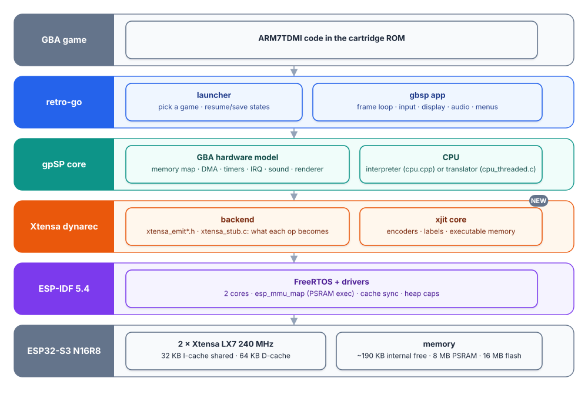

# xtensa-68000-dynarec

Dynamic recompilers (JIT) for retro CPUs on the **ESP32-S3** (Xtensa LX7, 240 MHz,
32 KB instruction cache, 8 MB PSRAM), built for the
[esp32-emu-turbo](https://github.com/pjcau/esp32-emu-turbo) handheld and its
[retro-go](https://github.com/pjcau/retro-go) fork.

- **Today:** a Game Boy Advance (ARM7TDMI / Thumb) dynarec: an Xtensa backend for
  [gpSP](https://github.com/libretro/gpsp), plus `xjit`, a small reusable JIT core
  (instruction encoders, labels, literal pools, executable memory).
- **In progress:** a Motorola **68000** dynarec (`m68kjit`) on the same `xjit` core,
  on top of the Musashi interpreter the Neo Geo, CPS1 and Mega Drive emulators
  already use. It is instruction-for-instruction equal to Musashi in QEMU (84 % of
  random 68000 code translated natively, block chaining); the emulator
  integration and the board come next. The same rules apply: both engines in one
  app, automatic fallback to the interpreter, never slower than the interpreter.

## Status (GBA)

| | |
|---|---|
| Correctness | Video **and** audio hashes bit-identical to gpSP's own x86 dynarec (QEMU, Sonic Advance, Metal Slug Advance, TMNT, 300/600 frames of level save states) |
| Speed | 56-60 emulated fps in play on the board; 68-88 fps-equivalent of CPU headroom at steady state (deterministic benchmark) |
| Compatibility | 11 of 12 tested games on the dynarec, correct graphics (webcam checked); NFS Underground falls back to the interpreter automatically |
| Safety | Automatic interpreter fallback on self-modifying-code storms and after a crash/hang; save states and battery saves are engine-independent |

| Game (played, board) | Emulated fps | Shown fps |
|---|---|---|
| Sonic Advance | 58.8 | 54.5 |
| Metal Slug Advance | 55.7 | 55.6 |
| TMNT | 59.5 | 58.7 |
| GTA, Pokemon Fire Red (IT), Prince of Persia, Sonic Advance 2, SF Alpha 3, SMA4, Millionaire Jr | ~60 in play | ~60 |
| Mario Kart Super Circuit (race) | 44-51 | 44-51 |
| NFS Underground (interpreter fallback) | 13 | 13 |

## Layout

| Path | What |
|---|---|
| `components/xjit/` | The shared JIT core: `xjit_emit.h` (Xtensa encoders, byte-identical to `xtensa-esp32s3-elf-as`), `xjit_block.c` (labels, literal pool), `xjit_exec.c` (executable IRAM / PSRAM memory, cache sync) |
| `components/gbsp-libretro/` | gpSP with the Xtensa backend in `xtensa/` (`xtensa_emit.h`, `xtensa_emit_ops.h`, `xtensa_stub.c`) and the esp32-emu-turbo changes (two-core renderer, VRAM copy, m4a mixer HLE, battery-save flags) |
| `test/xjit-test/` | Encoder tests against the assembler, generated-code tests in QEMU and on the board, a mini Thumb frontend differential test |
| `test/gbajit-test/` | gpSP in QEMU (ESP32-S3, 8 MB octal PSRAM) from a ROM and a level state; `x86ref/` builds gpSP's x86 dynarec as the bit-exact reference |
| `components/m68kjit/` | The 68000 frontend: instruction lengths, block cache, dispatcher, native translation and chaining on top of a Musashi interpreter |
| `test/m68k-test/` | The 68000 differential fuzz against Musashi 4.5 (vendored, MIT): on the PC (C model, mutations) and in QEMU (Xtensa code) |
| `docs/` | Architecture, verification, performance, fallback, the 68000 frontend and its roadmap |

The retro-go app that runs it (`gbsp/main/main.c`: frame loop, three frame buffers,
per-game engine state, battery saves, `GBAPROF` / `GBABENCH`) lives in the retro-go
fork, which includes this repository as a submodule.

## Documentation

- [Architecture](docs/architecture.md): the pieces, where each lives in memory, how a frame runs, the host register map, the code shape
- [Verification](docs/verification.md): encoder tests, QEMU vs the x86 reference, board benchmark, compatibility runs
- [Performance](docs/performance.md): what each step gave, the LX7 counters, what did not help and why
- [Fallback and saves](docs/fallback.md): when and how a game switches to the interpreter
- [68000 frontend](docs/m68k.md): blocks on top of Musashi, native instructions, chaining, verification
- [68000 roadmap](docs/roadmap-68000.md): steps 8a-8g done, the emulators next

## Quick start (QEMU, no board)

Needs Docker. The easiest way to get Espressif's QEMU with ESP32-S3 PSRAM support
is the image in `docker/` (or unpack it yourself, see `test/xjit-test/README.md`):

    docker build -t xjit-idf docker/
    export XJIT_IMAGE=xjit-idf

ROMs and level states are **not** part of this
repository: point `XJIT_ROMS` at a directory with `<game>.gba` and `<game>.state`.

    cd test/gbajit-test
    ./docker.sh "GBAJIT=1 idf.py -B build_jit -DSDKCONFIG=build_jit/sdkconfig build"
    ./docker.sh "B=build_jit ./run.sh sonic 400"
    # GBAJIT frames 300 hash 7ce642f7 audio 3a63b955 ...  (== x86ref/refs_x86jit.txt)

## License and credits

GPL-2.0 (see `COPYING`), as gpSP.

- **gpSP** by Exophase, and the libretro/gpsp contributors (David Guillen Fandos and
  others): the emulator, the translator and the x86/ARM/MIPS backends this Xtensa
  backend follows.
- **retro-go** by Alex Duchesne: the ESP32 frontend gpSP runs in.
- **Dragonfruit** (MIT, Kevin Fisher): reference for a few Xtensa encodings and for
  a 68000 JIT on the ESP32-S3.
- **Musashi** by Karl Stenerud (MIT since 4.x): the 68000 interpreter `m68kjit` builds
  on; version 4.5 is vendored in `test/m68k-test/musashi` as the fuzz reference, with
  John R. Hauser's SoftFloat it depends on.
- The Xtensa backend, `xjit`, `m68kjit` and the test benches: written for esp32-emu-turbo.
