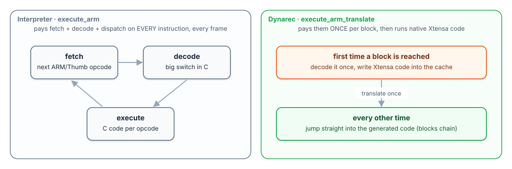
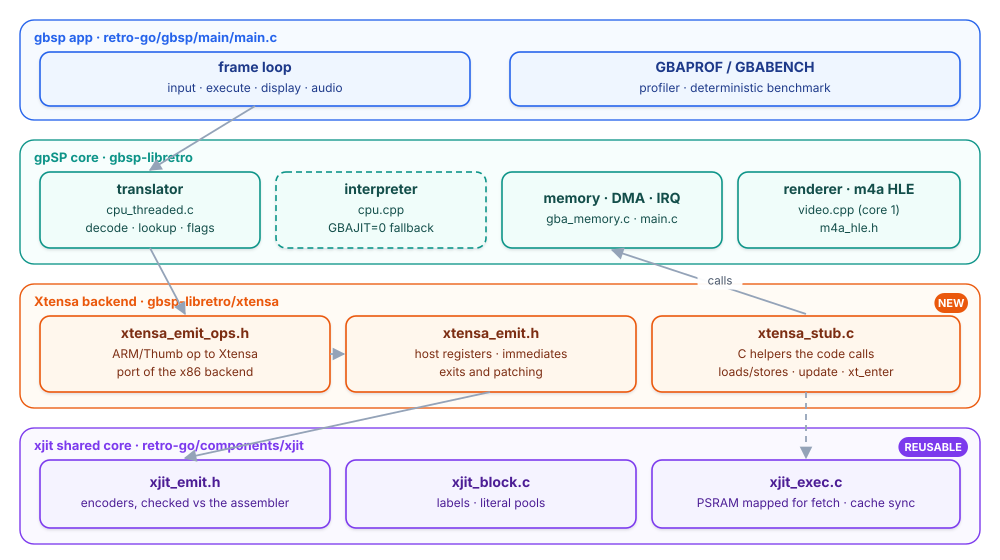
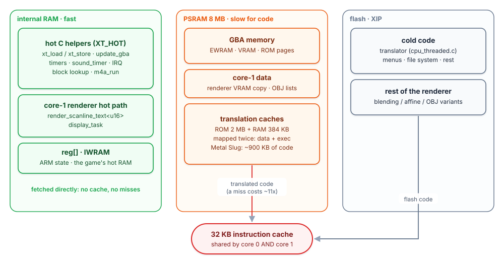
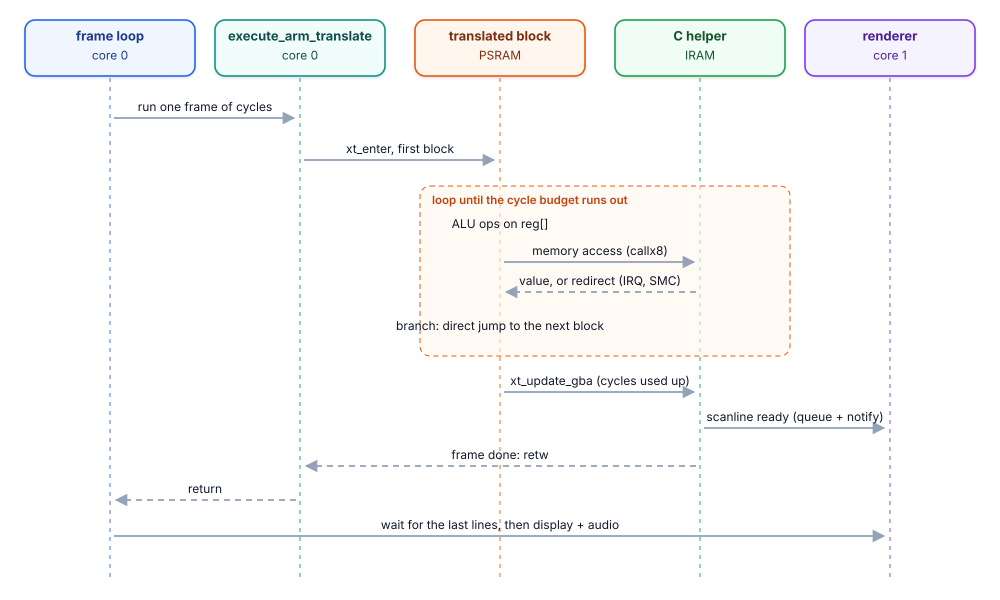
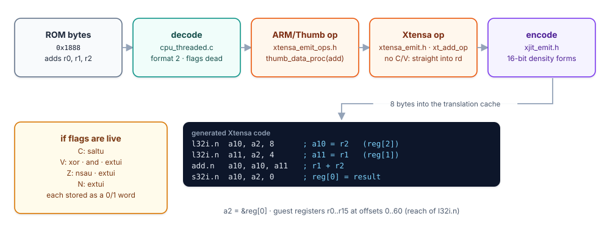
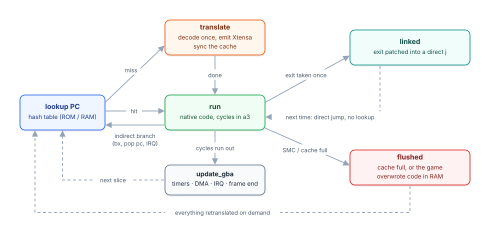

# Architecture

An interpreter pays fetch + decode + dispatch on every guest instruction, every
frame. The dynarec pays them once per block and then runs native Xtensa code. On
the ESP32-S3 that only wins if the generated code runs fast, and that depends
mostly on **where it is stored**.

## The pieces

| Piece | File(s) | Role |
|---|---|---|
| Shared JIT core | `components/xjit/` | Xtensa encoders (checked byte for byte against `xtensa-esp32s3-elf-as`), block/label/literal helpers, executable memory in IRAM or PSRAM |
| Translator | `components/gbsp-libretro/cpu_threaded.c` | gpSP's own: ARM/Thumb decode, block splitting, flag liveness, block lookup, self-modifying-code (SMC) flushes. Small `XTENSA_ARCH` hooks only |
| Backend | `components/gbsp-libretro/xtensa/xtensa_emit.h`, `xtensa_emit_ops.h` | What each guest instruction becomes. A port of gpSP's x86 backend, so its output can be compared with the x86 dynarec instruction by instruction |
| Runtime | `components/gbsp-libretro/xtensa/xtensa_stub.c` | The C side the generated code calls: memory handlers per region, `update_gba` at the end of a time slice, indirect-branch lookup, CPSR/SPSR, SWI, HLE divide, the m4a mixer hook; generates the `xt_enter` trampoline |

## Where everything lives

The ESP32-S3 has 8 MB of PSRAM, ~200 KB of internal RAM and one **32 KB
instruction cache shared by both cores**. Rules that came out of measurements:

- **Translated code runs from PSRAM through the I-cache** (mapped a second time
  for instruction fetch with `esp_mmu_map(MMU_MEM_CAP_EXEC)`, synced with
  `esp_cache_msync`: write back through the data alias, invalidate **whole lines**
  through the instruction alias). Metal Slug generates ~900 KB of it.
- **Everything else that runs every frame goes to IRAM** (`XT_HOT`): the helpers
  called by generated code, `update_gba`, timers, the sound timer, the block
  lookup, `m4a_run`, `update_scanline`, and the core-1 renderer's common tile path.
  This was the largest single gain: flash code evicted translated code.
- **Internal RAM is shared by both cores and they contend for it.** Core-1 data
  (the renderer's OBJ lists, its VRAM copy) goes to PSRAM; core-0 hot data (guest
  IWRAM, `reg[]`, a 512-entry block-lookup cache) stays internal.
- **The internal RAM budget is tight:** every function in IRAM costs internal RAM;
  below ~20 KB free the SD card file system can no longer open files. The
  interpreter kept as a fallback therefore stays in flash.

## How a frame runs

- Core 0 runs the guest CPU: `execute_arm_translate` enters translated code through
  `xt_enter`; blocks chain with patched direct jumps; memory accesses call C
  handlers; `xt_update_gba` ends each time slice (timers, DMA, sound, scanlines,
  interrupts) and, at the end of the frame, returns through `retw`.
- Core 1 draws the scanlines late, from per-line copies of the I/O registers, OAM
  and palette, and from **its own copy of VRAM**: CPU stores, dynarec stores and
  DMA mark the 1 KB pages they write, and the dirty pages are copied when the next
  line is queued. A VRAM write never waits for core 1.
- The app (retro-go) keeps three frame buffers so emulation never waits for the
  20 MHz LCD bus; the render task runs below the display task so the LCD DMA
  buffers are refilled at once.

## Host register map

| Xtensa | Use |
|---|---|
| `a0`, `a1` | return address and stack of `xt_enter` (windowed ABI) |
| `a2` | `&reg[0]`: guest registers, flags, helper table |
| `a3` | cycles left in the time slice |
| `a4`, `a6`, `a7` | guest `r0`, `r1`, `r2`: they survive `callx8`; synced with `reg[]` only on entry/exit and around C code that reads or writes them (HLE divide, m4a, cheats) |
| `a5` | start PC of the block (PC-relative constants) |
| `a8` | helper call target, x86 `esi` |
| `a10`, `a11`, `a12` | x86 `eax`/`edx`/`ecx`: operands, helper arguments, result |
| `a9`, `a13`-`a15` | scratch |

The other guest registers and the flags (as 0/1 words) live in `reg[]`, as in the
x86 backend. The common Thumb ALU ops (`add`/`sub`, `and`/`eor`/`orr`,
`cmp`/`cmn`/`tst`, `mov` immediate) work on the mapped registers directly.

## Code shape

- **16-bit density forms** (`l32i.n`, `s32i.n`, `mov.n`, `add.n`, `addi.n`,
  `movi.n`) wherever they fit: all guest registers sit within reach of `l32i.n`.
- **Flags** are computed only when the translator says they are live.
- **Exits**: the hot path of a branch is `bgez a3, +2; j cold; j exit`. The
  end-of-slice `update_gba` call, the exit literal (`.word target; l32r; jx`) and
  the redirect after a store live in a cold area at the end of the block. Once
  the target block exists, the exit `j` is patched into a direct jump.
- **Stores** pass the PC and the cycles left as arguments; the handler writes them
  to `reg[]` (the x86 code stored them before every call).
- **Constants**: `movi`, a PC-relative `addi` from `a5`, or an inline literal.

## Life of a block

A flush of the RAM translation cache from inside a helper (SMC, an I/O write)
must not rewrite the block the helper returns into: the tags are cleared, new
code is appended, and the cache goes back to its start only at the beginning of a
frame (or when nearly full). gpSP's x86 stub never returns into flushed code; a C
helper does.
