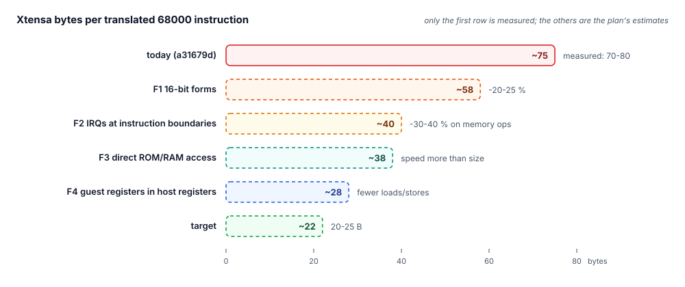
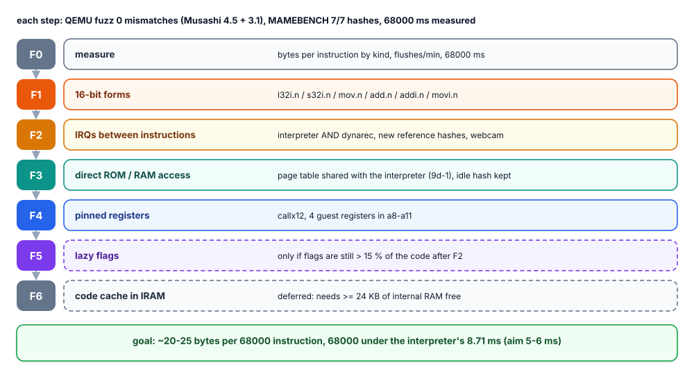
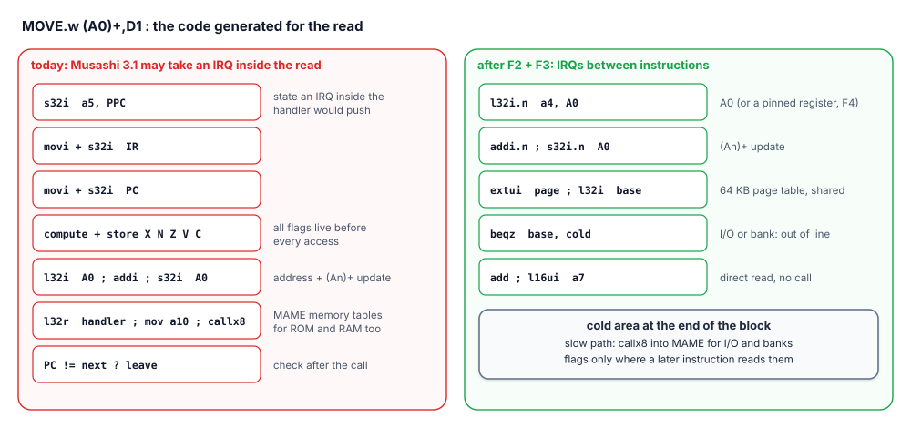
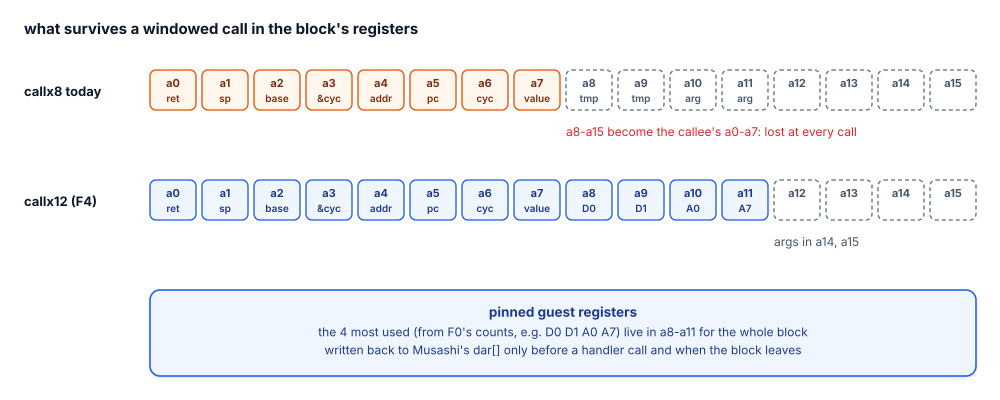

# 68000 code generation plan (step 9f)

How to make the code `m68kjit` generates small enough to fit the ESP32-S3's
instruction cache, so the dynarec beats the interpreter on Neo Geo and CPS1.
Agreed 2026-10-01. Status of each step is kept in the table at the end.

**On hold since 2026-10-03**, after F0-F2: see [68000 in mame-go](mame.md) for
the board numbers and what would reopen it.

## Where we are

On the board (Metal Slug, MAMEBENCH, mame-go with the 9d interpreter work):

| | 68000 ms per frame |
|---|---|
| interpreter (Musashi 3.1, 9d) | 8.71 |
| dynarec (a31679d), 1 MB code cache | 13.87 |

The dynarec is exact (7/7 screen hashes) but slower. It emits **70-80 bytes of
Xtensa code per 68000 instruction**. The hot code does not fit the 32 KB
instruction cache shared by both cores, so it keeps refetching from PSRAM, and
with the PSRAM mame-go leaves free the code cache also flushes 30-40 times a
minute.

The main reason is in the glue for mame-go's Musashi 3.1:
`mem_may_interrupt = true`. That Musashi takes an interrupt at once, even from
inside a memory handler, so before **every** memory access the block stores
PPC, IR and PC and keeps all five flags (X N Z V C) current, then calls the
memory handler through MAME's tables, even for ROM and work RAM.

## The steps

Rules for every step:

- QEMU differential fuzz: 0 mismatches against Musashi 4.5 and 3.1
  (`test/m68k-test`), all passes.
- MAMEBENCH on the board: the 7 screen hashes unchanged (F2 sets new ones once).
- 68000 ms per frame measured against the interpreter. A step that does not
  pay is reverted.

### F0. Measure first

Add per-kind counters to `m68kjit_stats`: Xtensa bytes per translated 68000
instruction, split into register-only, memory, handler call and branch; the
share of flag code; cache flushes per minute. Record the baseline on Metal Slug
(MAMEBENCH) and on the QEMU fuzz ROMs. Every later step reports against it.

### F1. 16-bit instructions

`xjit` already has the density encoders (`xj_l32i_n`, `xj_s32i_n`, `xj_mov_n`,
`xj_add_n`, `xj_addi_n`, `xj_movi_n`, `xj_beqz_n`, `xj_bnez_n`), but `m68kjit`
only uses `retw.n`. Point the block's base register `a2` at `dar[0]` so all 16
guest registers sit at offsets 0..60, inside the reach of `l32i.n`/`s32i.n`; the
other Musashi fields stay within the 24-bit forms' reach. Then use the 16-bit
form wherever its operand range allows.

Expected: 20-25 % less code. No semantic change, so the fuzz and the hashes must
not move at all.

### F2. Interrupts between instructions

The largest saving. The real 68000 takes interrupts only between instructions,
and so does Musashi 4.x; mame-go's 3.1 takes them inside `m68k_set_irq()`, which
a memory handler can call in the middle of an instruction.

- In mame-go's Musashi: `m68k_set_irq()` only latches the new level; the
  interrupt is taken at the next instruction boundary.
- The change goes into the **interpreter and the dynarec together**, so the two
  stay bit-identical to each other. Exactness against the old 3.1 behaviour is
  given up on purpose.
- New MAMEBENCH reference hashes, recorded once, after played runs with the
  webcam on Metal Slug 2, Sonic Wings 2, KOF '95, Street Fighter II and Final
  Fight (sound, attract mode, a level each).
- Then the glue sets `mem_may_interrupt = false`: no PPC/IR/PC stores before an
  access, and flag liveness works across memory accesses.

Expected: 30-40 % less code on memory instructions, which are most of the
executed ones in these games.

### F3. Direct ROM and RAM access

Together with the interpreter's 9d-1 work, one table for both:

- A table of 256 pages of 64 KB over the 24-bit bus. Each entry is a host base
  pointer, or 0 for "slow" (I/O, banked areas, anything with side effects). This
  is the same idea as FAME/C's `Fetch[]` banks.
- In the generated code: page index (`extui`), one load from the table, a branch
  to the cold area when the entry is 0, then the direct access. Words follow MAME
  0.37's byte order for 68000 memory on a little-endian host (16-bit words
  native; bytes at `addr ^ 1`; longs as two halves).
- The slow path (the call into MAME) goes to the cold area at the end of the
  block.
- Writes to work RAM also update the write hash that feeds the generic idle-loop
  skip (today it is computed in `m68ki_write_*()`), or the Neo Geo idle skip
  stops working.
- Only fixed mappings go in the table: Neo Geo P1 ROM and work RAM, CPS1 program
  ROM and work RAM. Bank switches update the table or mark the page slow.

Expected: no `callx8` on the common accesses. This matters more for speed than
for size.

### F4. Guest registers in host registers

With `callx8` only `a0`-`a7` of the block survive a call; `a8`-`a15` become the
callee's `a0`-`a7`. With `callx12` the block keeps `a0`-`a11`, and the callee's
arguments go in `a14`/`a15`.

- Switch the block's calls to `callx12` and keep the 4 most used guest registers
  (from F0's counts, likely D0, D1, A0, A7) in `a8`-`a11` for the whole block.
- Write them back to Musashi's `dar[]` only before a call into a handler (which
  reads `dar[]`) and when the block leaves; reload after the call.

### F5. Lazy flags, only if still needed

Record the operands and the operation instead of the flags, and compute flags
only when something reads them. After F2 the existing flag liveness removes most
flag code, and every handler call still needs Musashi's flag variables current.
Done only if F0, repeated after F2, shows flag code above 15 % of the total.

### F6. Code cache in internal RAM: deferred

A 16-20 KB hot-code cache in IRAM would avoid PSRAM fetches entirely, but
mame-go leaves about 22 KB of internal RAM free and below ~13 KB the file system
cannot open a ROM (the same wall the GBA hit with `GBAJIT_IRAM=1`). It comes back
only if a later change frees at least 24 KB. The hot threshold (blocks are
translated only after N visits) stays.

## Goal

About 20-25 bytes of Xtensa code per 68000 instruction, the hot code of a level
inside the 32 KB instruction cache, and the 68000 under the interpreter's
8.71 ms, aiming for 5-6 ms per frame. With the video work of step 9d that brings
Metal Slug 2 close to 60 fps.

## Status

| Step | Status | Result |
|---|---|---|
| F0 measure | done on the QEMU fuzz (2026-10-02), board pending | `m68kjit_stats` counts Xtensa bytes per kind of 68000 instruction and the flag code; printed by the fuzz (`M68K BYTES/INSN`) and by mame-go's `M68KJIT` report. Fuzz ROMs, 24-bit forms: register-only 32.7 bytes, memory 100.7, handler call 46.9, branch 51.5; flag code 8 % (F5 not needed by the plan's 15 % rule, on these ROMs). |
| F1 16-bit forms | done (2026-10-02) | `ld32/st32/mov32/addi32/movi32` pick the density form when the operand allows (`-DM68KJIT_WIDE` restores the 24-bit forms). Fuzz ROMs: 29.8 / 90.0 / 42.1 / 48.4 bytes, about 10 % less (not the 20-25 % hoped: most of a memory instruction is not loads and stores). QEMU: 0 mismatches on every pass. Board timing pending. |
| F2 IRQs between instructions | done in the glue (2026-10-02), board count pending | mame-go's glue sets `mem_may_interrupt = false`: the 68000's interrupts on Neo Geo and CPS1 come through MAME's timers, between instructions (the only direct `cpu_set_irq_line()` calls from handlers go to the Z80), so no flag materialisation before memory call-outs. `-DM68KJIT_MEMIRQ` restores the old generation. NEOPROF builds count interrupts raised inside a memory call-out of the native code (`irq in mem call-out` in the `M68KJIT` report: must stay 0). QEMU against Musashi 3.1: 0 mismatches, memory instruction 89.8 bytes (as the 4.5 glue). Musashi itself is unchanged: the hashes cannot move. |
| F3 direct ROM/RAM access | on hold | The esp32-emu-turbo plan (2026-10-02, "Revised plan") put phase J after a core-0 pass: on Metal Slug the dynarec runs at 78 host cycles per 68000 instruction against the interpreter's 46, I-cache bound (635 KB of code behind a 32 KB cache, 12 flushes in 70 s; the sampler shows ~9 % of core 0 in translation and ~7 % in cache synchronisation). First J step when it resumes: the flush policy and the hot threshold; F3 as an IRAM stub (an inline table walk is longer than the call it replaces). |
| F4 pinned registers | on hold with F3 | The per-register load/store counts it needs are in the `M68KJIT` report (F0). |
| F5 lazy flags | only if needed | |
| F6 IRAM code cache | deferred | |

Figures: drawn by `website/scripts/gen_svgs_codegen.py` in the esp32-emu-turbo
repository.
