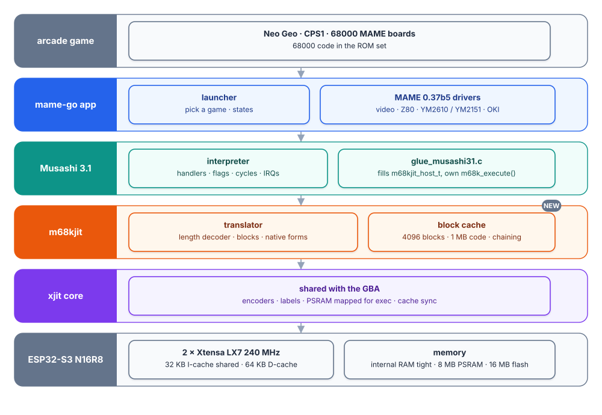
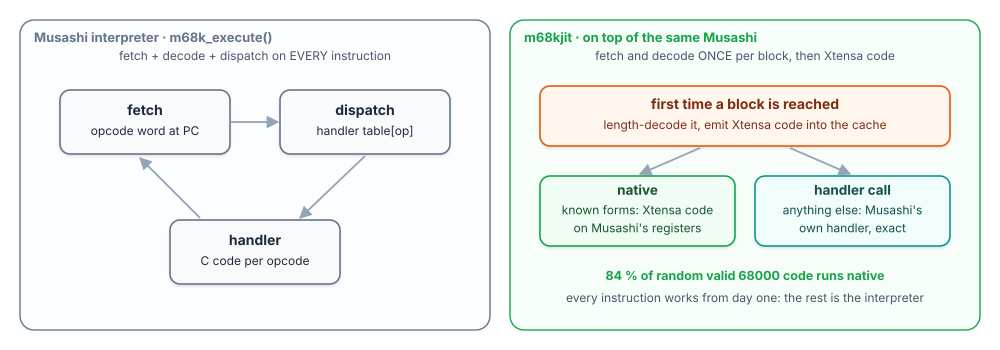
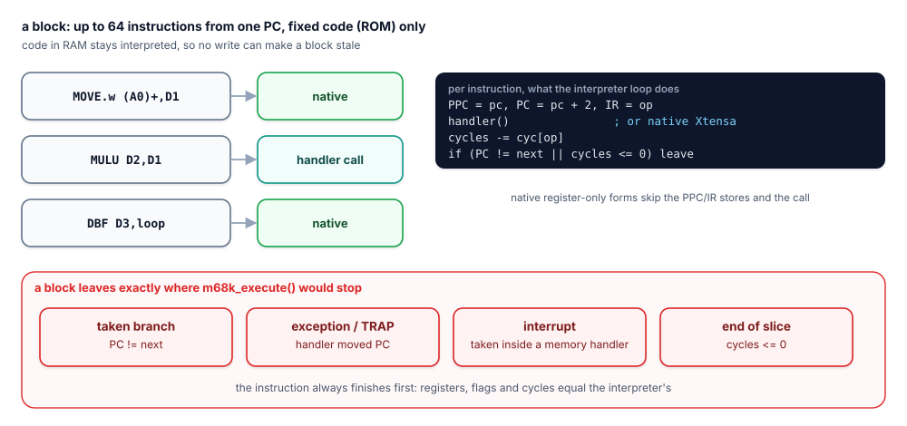
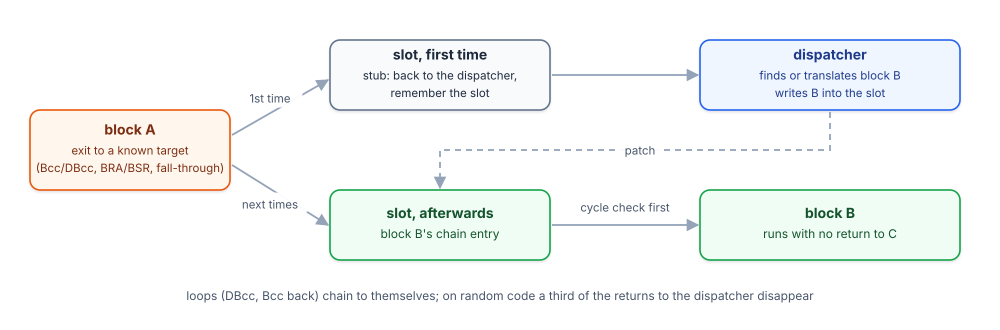

# 68000 dynarec in mame-go (Neo Geo, CPS1, MAME)

`m68kjit` is the 68000 frontend on `xjit`. In `mame-go` (MAME 0.37b5 on the
handheld: Neo Geo, Capcom CPS1 and the other 68000 boards) it replaces the loop
of the 68000 interpreter, Musashi 3.1, with translated blocks.

**The code is finished and exact. On the board it is slower than the
interpreter, so it is switched off and on hold** (decision of 2026-10-03). This
page says how it plugs in, what was measured, why, and what would reopen it.
How the translator itself works is in [68000 frontend](m68k.md).

## How it plugs into MAME

| Layer | Where | Role |
|---|---|---|
| mame-go | `retro-go/mame-go` (the retro-go fork) | MAME drivers; calls `m68k_execute()` for each CPU time slice |
| Musashi 3.1 | inside mame-go | the interpreter the dynarec leans on: registers, flags, cycle counter, opcode handlers |
| glue | `components/m68kjit/glue/glue_musashi31.c` | compiled against mame-go's Musashi: fills `m68kjit_host_t` and provides an `m68k_execute()` whose loop body is `m68kjit_run()` |
| m68kjit | `components/m68kjit/` | length decoder, block builder, native forms, block cache (4096 blocks, 1 MB of code in PSRAM), chaining |
| xjit | `components/xjit/` | the Xtensa encoders, labels and executable PSRAM, shared with the GBA |

The dynarec does not replace Musashi, it runs on top of it. Translated code
works directly on Musashi's registers and flags, and any instruction the
translator does not know becomes a call to Musashi's own handler. A block is up
to 64 instructions of fixed code (ROM only: code in RAM stays interpreted) and
leaves exactly where `m68k_execute()` would stop.

It is built into mame-go with `M68KJIT=1` in the build environment; without it
the firmware has the interpreter only. mame-go's benchmark build
(`MAMEBENCH`, `NEOPROF`) prints an `M68KJIT` report: blocks, bytes of code per
kind of instruction, cache flushes, interrupts raised inside a memory call-out.

## What was measured

Board: ESP32-S3 N16R8, Metal Slug, the deterministic benchmark of mame-go.

| | Interpreter | Dynarec |
|---|---|---|
| Screen hashes | reference | identical (7 of 7) |
| 68000 per frame, attract loop | 7.7 ms | 13.1 ms |
| Host cycles per 68000 instruction | 46 | 78 |
| Bytes fetched per 68000 instruction | 2-6 (the guest code) | 70-80 (translated Xtensa code) |
| Through which cache | data cache, 64 KB | instruction cache, 32 KB, shared with all the firmware |
| Translated code for the game | - | 635 KB, cache flushed 12 times in 70 s |

About 9 % of core 0 went to translation and 7 % to synchronising the caches for
new code.

## Why it loses here

The usual case for a dynarec is that it removes decode and dispatch. On this
chip the cost is memory, not instruction count:

- the interpreter's own code is a few tens of kilobytes that stay hot; what
  streams through the cache is the guest program, 2 to 6 bytes per instruction;
- the dynarec turns each guest instruction into 70-80 bytes of host code, read
  from PSRAM through a cache half the size;
- a Neo Geo game runs a lot of distinct code every frame, so the hot set never
  fits.

The GBA dynarec lives with the same cache and wins, because a GBA game's hot
code per frame is far smaller and its interpreter is far slower.

## What was done instead

The 68000 time was cut in the **interpreter**, in mame-go's Musashi (not in this
repository): wait loops are recognised and skipped exactly, after being proven
(a loop that counts its turns; an idle loop whose registers, status, writes and
I/O reads repeat). 55.7 % of Metal Slug's executed cycles in play were one
vblank wait loop.

| Game, scripted benchmark, in play | 68000 ms per frame before | after |
|---|---|---|
| Metal Slug | 10.8 | 7.0 |
| Final Fight | 9.7 | 6.8 |
| Street Fighter II CE | 9.8 | 6.1 |

(On screens where a game mostly waits the gain is larger: Final Fight's intro
story went from 7.4 to 2.7 ms.)

Pictures and sound samples are identical frame by frame on the PC harness. The
details and the remaining frame budget are in the handheld's documentation:
[68000 dynarec page](https://pjcau.github.io/esp32-emu-turbo/docs/software/m68k-dynarec)
and [Arcade 60 fps plan](https://pjcau.github.io/esp32-emu-turbo/docs/next-steps/arcade-60fps-plan).

## What would reopen it

One of these, measured:

1. **The hot translated code in internal RAM.** A build that frees 64 KB or more
   of internal RAM for a code cache. Today 0 to 18 KB are free while a game runs.
2. **Code three times denser**, about 25 bytes per 68000 instruction: steps F3
   to F5 of the [code generation plan](codegen-plan.md) (direct ROM and RAM
   access, guest registers pinned in host registers, lazy flags). F1 (16-bit
   forms) gave 10 % less code, F2 (interrupts between instructions) removed the
   flag bookkeeping before memory accesses; neither changed the order of
   magnitude.
3. A full benchmark run under the interpreter's time, on any game.

The first estimate for this work (a 68000 1.5 to 2.5 times faster) was made
before any board measurement and did not hold.

## Verification

`test/m68k-test`, see [68000 frontend](m68k.md):

1. instruction lengths equal to Musashi's disassembler on all 45799 valid opcodes;
2. the block model against `m68k_execute()` on random machines, with mutations the fuzz must catch;
3. generated code in QEMU against Musashi 4.5 and 3.1: random valid code, native-heavy ROMs and each instruction family alone, compared after each of 32 time slices with random interrupt levels (registers, SR, stack pointers, cycles, RAM hash): 0 mismatches;
4. on the board, the interpreter's screen hashes.
