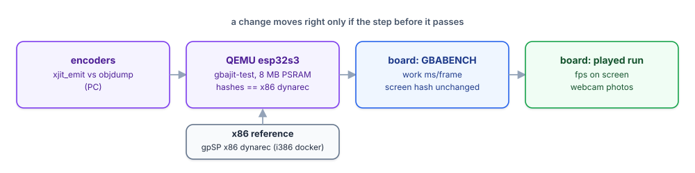

# Verification

A change moves to the next step only if the step before it passes.

## 1. Encoders (PC)

`components/xjit/test/run_emit_test.sh` encodes ~125 KB of random instructions of
every kind with `xjit_emit.h` and compares them byte for byte with
`xtensa-esp32s3-elf-as`.

## 2. Generated code (QEMU, then the board)

`test/xjit-test` runs blocks with labels, a literal pool, calls into C, 26 branch
kinds, loads/stores and 2000 random ALU programs against a C reference, from IRAM
and from PSRAM mapped executable. The board found what QEMU cannot: the
instruction-cache invalidate must cover whole cache lines.

A mini Thumb frontend (formats 1-5) is compared with a reference interpreter on
random instruction sequences, and that reference with gpSP's own interpreter on
the PC (`test/xjit-test/host/run_thumb_gpsp_check.sh`).

## 3. Bit-exact reference (QEMU)

`test/gbajit-test` runs gpSP in Espressif's QEMU (ESP32-S3 with 8 MB octal PSRAM:
the `esp_develop` 9.2.2 build; the 9.0.0 one in the idf:v5.4 image has no S3
PSRAM) from a ROM and a level save state in flash partitions, with a fixed input
script, and prints a video and an audio hash every 300 frames:

    GBAJIT frames 300 hash c48f419a audio fc613205 (…)

The reference is **gpSP's x86 dynarec**, built as 32-bit with SSE float math
(`test/gbajit-test/x86ref`, hashes in `refs_x86jit.txt`): the dynarec counts
cycles per block, so its frames differ from the interpreter's; x87 float math
rounds the audio mixer differently. The Xtensa backend must match it exactly.
The only accepted difference is audio where the m4a mixer HLE is active.

Build switches of the test bench:

| Switch | Effect |
|---|---|
| `GBAJIT=1` | build with the dynarec |
| `-DMENU_SCRIPT` | cold boot (no state), START/A every 4 s: compatibility runs |
| `-DXT_RAMLOG` | print every RAM-cache block: guest PC, offset, host bytes |
| `-DXTDUMP` | print 4 KB of translated code at frame 300 (disassemble with `objdump -D -EL -b binary -m xtensa`) |

QEMU quirk: `esp_flash_read` in QIO mode returns data 2 bytes late; the bench uses DIO.

## 4. Board benchmark (retro-go app)

`GBABENCH=1` builds the app so that the game plays itself from its save state
with a frame-numbered input script. Every 300 frames it prints the CPU time per
frame (exec / render wait / display / sound), a screen hash that must not change
between two builds of the dynarec, the display time per sent frame, and the LX7
performance counters around the CPU emulation (cycles, instructions, instruction
and data stalls). It is bit-deterministic: same hashes, times within 0.02 ms.

## 5. Played runs and compatibility (board)

Release builds, fresh boots with menu presses, then play input; FPS from the
on-screen counter; webcam photos of every game. Save states are saved and loaded
(also across engines: a slot saved on the dynarec loads on the interpreter);
battery saves are written and read back.
